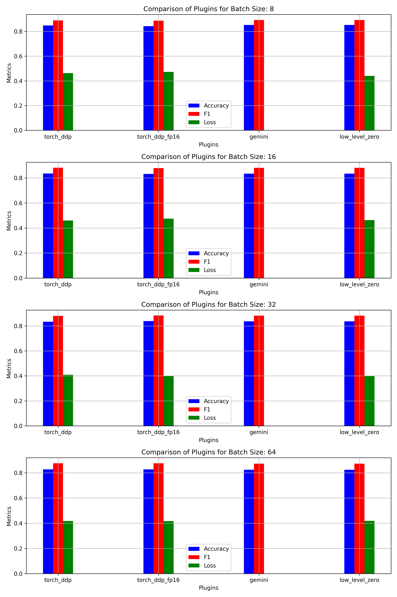
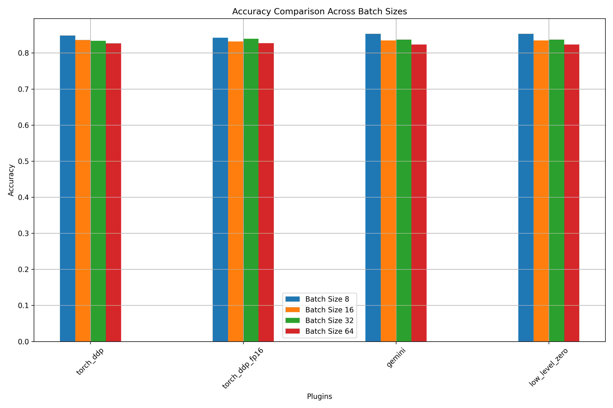

# Bert Benchmark
Bert experience with Colossal-AI.

## Overview

The experimental environment is a single GPU environment using Colab. It contains two main goals: first, use the Booster API to compare the "accuracy" and "F1 score" and "Loss" indicators and fine-tune HuggingFace's Bert model with different batch sizes(8, 16, 32, 64); second, use the CUDA of four different Booster plugins (torch_ddp, torch_ddp_fp16, gemini, low_level_zero) Benchmark memory usage, throughput, and total number of model parameters. This study aims to evaluate the performance and efficiency of different fine-tuning strategies facilitated by the Booster plugin, paying particular attention to their impact on model accuracy, computational resource allocation, and processing speed.

## Setup
Install dependencies

```
git clone https://github.com/luckysjj/Bert-finetuning-with-Colossal-AI.git
cd Bert-finetuning-with-Colossal-AI
pip install -r requirements.txt
```

## Finetune

```
bash test_ci.sh
```

Comparing the performance data of four distinct plugins.
```
python3 compare_data.py
```

### Bert-Finetune Results




## Benchmark
```
bash benchmark.sh
```

In this section, I compare these metrics in a benchmark: CUDA memory footprint, throughput, and number of model parameters. Due to CUDA memory limitations, I set BATCH_SIZE to 16.

| parameters  | | | |
| ------------|-------- |-------- |-------- |
| BATCH_SIZE   |16    | LEARNING_RATE    |2.4e-5 | 
| WEIGHT_DECAY |0.01   | WARMUP_FRACTION  |0.1    |
| SEQ_LEN   |512    | VOCAB_SIZE    |1000 | 
| NUM_LABELS |10   | DATASET_LEN  |1000    |

### Results

| plugin | cuda pre mem | cuda max mem | cuda post mem |throughput(sample/s) | params |
| :-----| -----------: |-----------: |-----------: | :-----------: | :-----------: |
| ddp | 1.31 GB |11.19 GB | 1.31GB |  0.6 | 86.82M |
| ddp_fp16 | 1.32 GB | 8.72 GB | 1.32 GB | 1.6 | 86.82M |
| gemini | 1.19 GB |6.49 GB | 1.19 GB |  2.2 | 86.82M |
| low_level_zero | 1.2 GB | 6.5 GB | 1.20 G | 2.0 | 86.82M |

